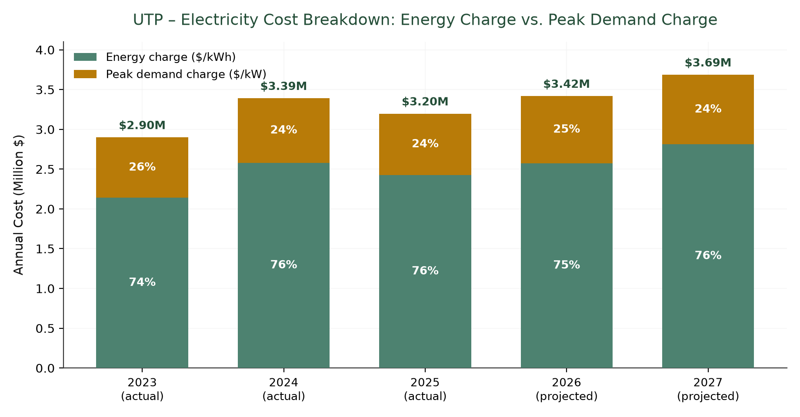
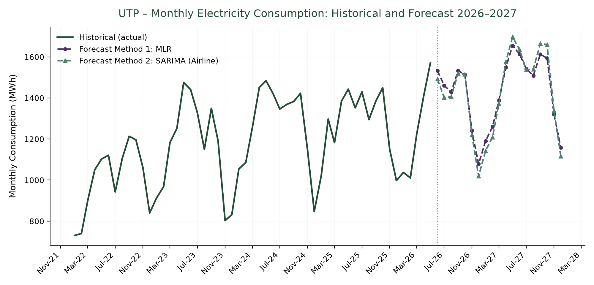
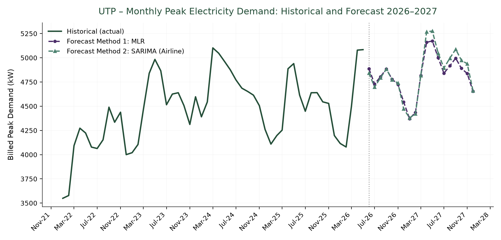
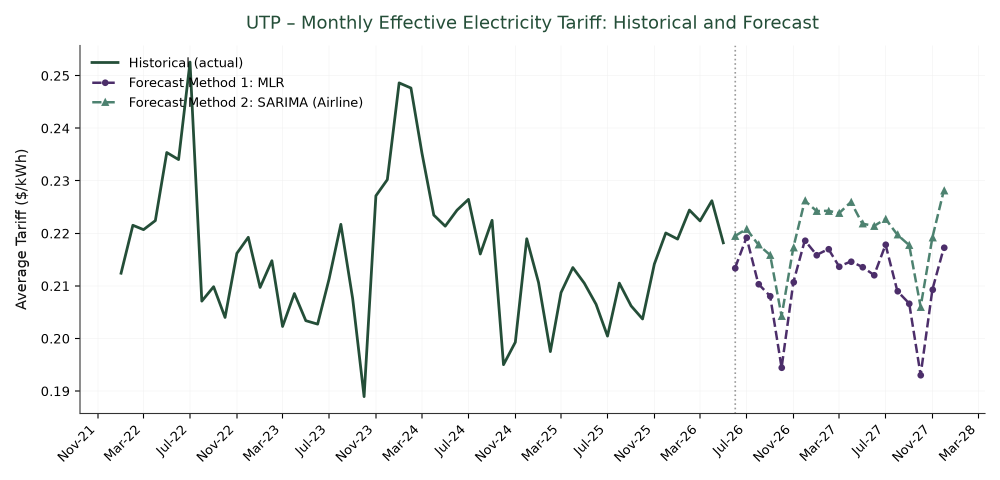
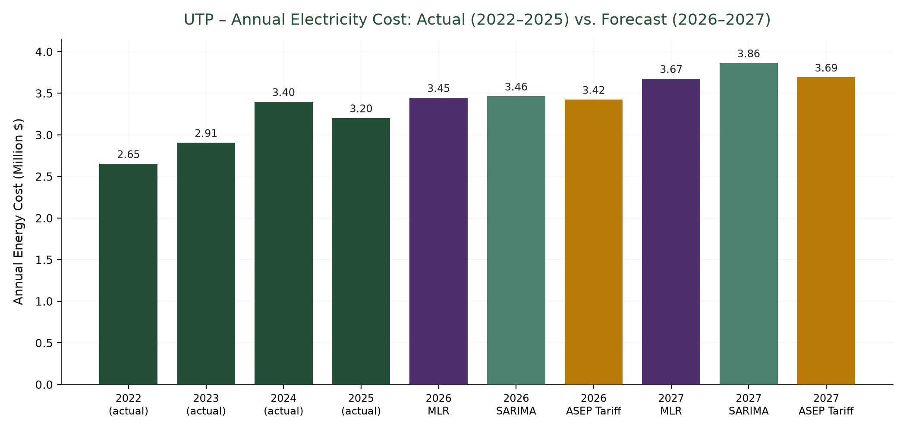
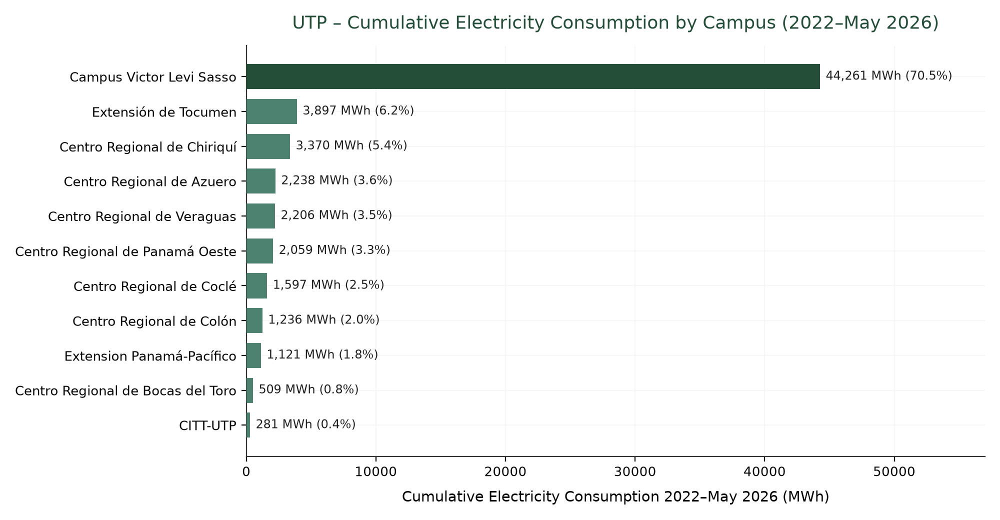

# Campus Electricity Forecasting & Regulatory Tariff Modeling (2026–2027)

Applied statistical time-series forecasting, out-of-sample backtesting, and regulatory tariff calibration for multi-campus institutional electricity budgeting at the **Technological University of Panama (UTP)**.

---

## Executive Summary

This repository implements an end-to-end analytical pipeline to forecast institutional electricity consumption, peak power demand, effective tariffs, and budgetary expenditures for **2026–2027** across all university campuses (54 active utility meters).

The analysis reconciles statistical forecasting models with the real regulatory rate structure established by Panama's National Public Services Authority (**ASEP**).

### Recommended Projections (2027 Horizon)

| Metric | Recommended Value | Range / Methods |
|---|---|---|
| **Annual Electricity Consumption** | **17,438 MWh** | 17,389 – 17,488 MWh (+13.3% vs. 2025) |
| **Institutional Peak Demand** | **5,225 kW** | 5,172 – 5,278 kW |
| **Annual Electricity Expenditure** | **US$ 3.69 Million** | US$ 3.67M (MLR) – US$ 3.86M (SARIMA) |
| **Volumetric Energy Cost Share** | **~76 %** | Multiplied by volumetric charge ($/kWh) |
| **Peak Power Demand Cost Share** | **~24 %** | Multiplied by monthly maximum peak ($/kW) |

---

## Electricity Tariff Structure & Demand Mechanics

In Panama's regulated electricity market (governed by ASEP for distribution utilities ENSA, EDEMET, and EDECHI), commercial and institutional Medium Voltage Demand (**MTD**) and Low Voltage Demand (**BTD**) rate classes operate on two distinct billing mechanisms:

1. **No Contracted Capacity Penalties:** Customers are **not** billed on pre-contracted capacity.
2. **Volumetric Energy Charge ($/kWh):** The total accumulated energy consumed across the billing period is multiplied by the active volumetric energy charge.
3. **Peak Demand Charge ($/kW):** Power demand is measured in rolling 10-to-15 minute intervals throughout the month. The **single highest peak recorded during the entire billing cycle** is multiplied by the demand charge ($/kW).

Historical cost decomposition demonstrates that this proportional split has remained remarkably stable across all years:



---

## Methodology

### 1. Method 1: Multiple Linear Regression (MLR)
A deterministic decomposition model incorporating a linear time trend and 11 seasonal monthly dummy variables (using January as baseline):

$$Y_t = \beta_0 + \beta_1 \cdot t + \sum_{m=2}^{12} \beta_m D_{m,t} + \varepsilon_t$$

- **In-sample fit:** $R^2 = 0.821$ (consumption), $R^2 = 0.641$ (demand).
- **Reference:** Kialashaki & Reisel (2013), *Applied Energy*, 108, 271–280.

### 2. Method 2: Seasonal Airline Model — $\text{SARIMA}(0,1,1)(0,1,1)_{12}$
A multiplicative seasonal ARIMA model fitted to the natural logarithm of the monthly aggregated series:

$$w_t = (1 - B)(1 - B^{12}) \ln(Y_t)$$
$$w_t = \varepsilon_t - \theta \varepsilon_{t-1} - \Theta \varepsilon_{t-12} + \theta \Theta \varepsilon_{t-13}$$

Estimated using **Conditional Sum of Squares (CSS)** via `scipy.optimize` with Nelder-Mead optimization. Out-of-sample projections apply an analytic lognormal retransformation bias adjustment:

$$E[\exp(X)] = \exp\left(\mu + \frac{\sigma^2}{2}\right)$$

- **Model Parity:** The manual SciPy implementation estimates only 2 free parameters ($\theta, \Theta$), guaranteeing convergence stability on short series (53 monthly observations) without requiring large state spaces.
- **Reference:** Box, G. E. P., & Jenkins, G. M. (1976). *Time Series Analysis: Forecasting and Control*.

> [!NOTE]
> **Why Holt-Winters Exponential Smoothing was Discarded:**
> Holt-Winters multiplicative smoothing was rigorously evaluated during initial benchmarking. Requiring the recursive tracking of ~15 latent states (level, trend, and 12 seasonal indices) on a 53-month historical sample caused severe overfitting, resulting in negative out-of-sample $R^2$ on tariff projections. The 2-parameter Airline model proved vastly more robust.

### 3. Method 3: Regulatory Tariff Calibration
Rather than assuming electricity rates follow an unconstrained statistical process, Method 3 incorporates official ASEP rate schedules for ENSA-MTD (Victor Levi Sasso Main Campus, accounting for ~94% of institutional peak demand and ~70.5% of total consumption).

- **Regulatory Shock Identification:** Between October 2024 and June 2025, a Supreme Court of Justice ruling (Resolution AN No. 19632-Elec) froze and reverted ENSA-MTD to 2018 provisional rates. Resolution AN No. 19850-Elec (effective July 2025) subsequently enacted an abrupt rate increase (+32% energy, +40% demand).
- **Empirical Calibration Factor:** Calibrated over the active regulatory regime (July 2025 to May 2026, 11 months):
  $$\text{Factor} = \frac{\text{Actual Billed Expenditure}}{\text{Theoretical MTD Cost}} = 0.8356 \quad (\sigma = 0.0252, \; \text{CV} = 3.01\%)$$
  This factor reflects the moderation provided by regional campus meters on lower BTD/BTS tariffs and institutional rate treatments.

---

## Out-of-Sample Backtesting Performance

Models were trained strictly on **2022–2024 data (36 months)** and evaluated against actual observed billing records across **all 12 months of 2025**:

$$\text{MAPE} = \frac{1}{n} \sum_{t=1}^n \left| \frac{y_t - \hat{y}_t}{y_t} \right| \times 100\%$$

| Target Variable | Method 1: MLR (MAPE) | Method 2: SARIMA Airline (MAPE) | Holt-Winters *(Discarded)* |
|---|:---:|:---:|:---:|
| **Electricity Consumption (kWh)** | 11.76 % | **7.77 %** | 22.9 % |
| **Peak Power Demand (kW)** | 12.21 % | **5.15 %** | 5.4 % |
| **Effective Tariff ($/kWh)** | 6.24 % | **4.50 %** | Negative $R^2$ |

---

## Visualizations & Results

### Monthly Consumption Forecast


### Monthly Peak Demand Forecast


### Effective Tariff Trend & Forecast


### Annual Budgetary Expenditure Comparison


### Cumulative Consumption by Campus


---

## Repository Structure

```
.
├── data/
│   ├── Data 2022-2026.csv                  # Raw meter-level monthly billing dataset
│   ├── meters_utp.csv                      # Official meter registry (campus, utility, tariff)
│   ├── tarifas_asep_utp_2023_2026.xlsx     # Structured ASEP master tariff tables (2023-2026)
│   ├── Tarifario_ASEP_2023_-_2026__OCT_.pdf# Official regulatory decree (ASEP)
│   └── monthly.csv                         # Cleaned institutional monthly time series (generated)
├── code/
│   ├── 01_data_cleaning.py                 # Ingestion, validation, and monthly aggregation
│   ├── 02_forecast_mlr.py                  # Method 1: Multiple Linear Regression (trend + dummies)
│   ├── 03_forecast_sarima_airline.py       # Method 2: Box-Jenkins SARIMA(0,1,1)(0,1,1)_12
│   ├── 04_backtesting.py                   # Out-of-sample validation (2025 holdout MAPE)
│   ├── 05_tariff_calibration.py            # Method 3: ASEP regulatory rate calibration
│   ├── 06_energy_demand_breakdown.py       # Cost decomposition (energy vs. peak demand)
│   ├── 07_exact_meter_tariff.py            # Meter-by-meter calculation engine & campus breakdown
│   ├── 08_generate_figures.py              # Generates all 6 publication-ready figures in figures/
│   └── run_all.py                          # Master orchestrator executing the full pipeline
├── figures/                                # Publication-ready chart assets
│   ├── fig_consumo.png
│   ├── fig_demanda.png
│   ├── fig_tarifa.png
│   ├── fig_costo_anual.png
│   ├── fig_consumo_por_sede.png
│   └── fig_desglose_energia_demanda.png
├── requirements.txt                        # Python dependencies
└── README.md                               # Project documentation
```

---

## How to Reproduce

### 1. Installation
Ensure Python 3.10+ is installed, then install the required dependencies:

```bash
pip install -r requirements.txt
```

### 2. Execution
Run the end-to-end pipeline with a single command:

```bash
python code/run_all.py
```

This sequentially:
1. Re-aggregates raw billing records to `data/monthly.csv`.
2. Evaluates the MLR and SARIMA Airline models.
3. Computes out-of-sample backtesting metrics.
4. Calibrates empirical tariff factors against regulatory schedules.
5. Decomposes campus-level and demand-vs-energy billing mechanics.
6. Regenerates all 6 high-resolution charts in `figures/`.

---

## License

Internal research and operational planning material developed for the **Universidad Tecnológica de Panamá (UTP)**. Institutional billing data is proprietary; regulatory electricity tariff schedules are public government records published by **ASEP**.

